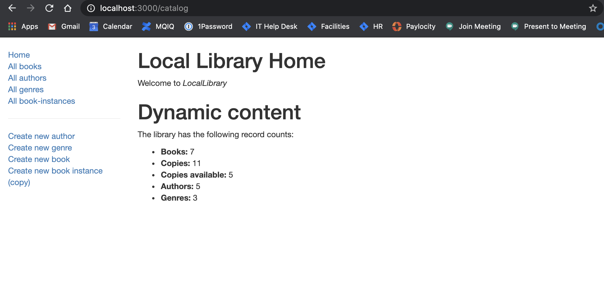
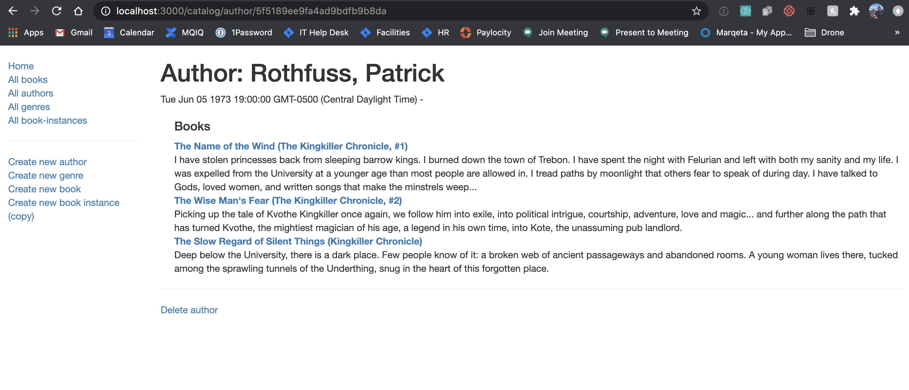
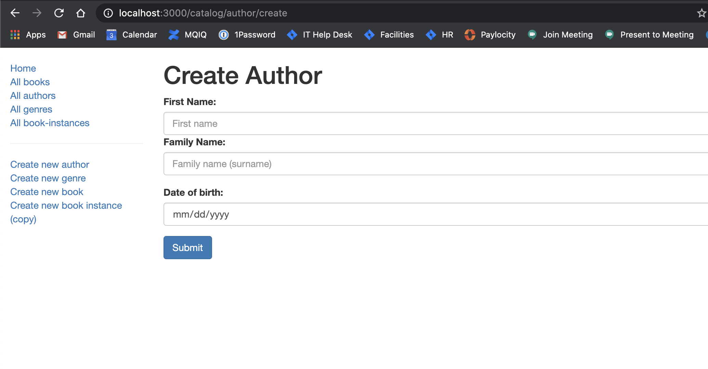

# library-webapp

Simple implementation of library webapp with mongodb integration based off the mozilla [tutorial](https://developer.mozilla.org/en-US/docs/Learn/Server-side/Express_Nodejs)

To run in debug mode
```
export MONGODB_URI="mongodb_uri_path"
DEBUG=library-webapp:* npm run devstart

```

To run in production mode
```
set NODE_ENV='production'
```
## Home page


## View books by author


## Form to add an author

